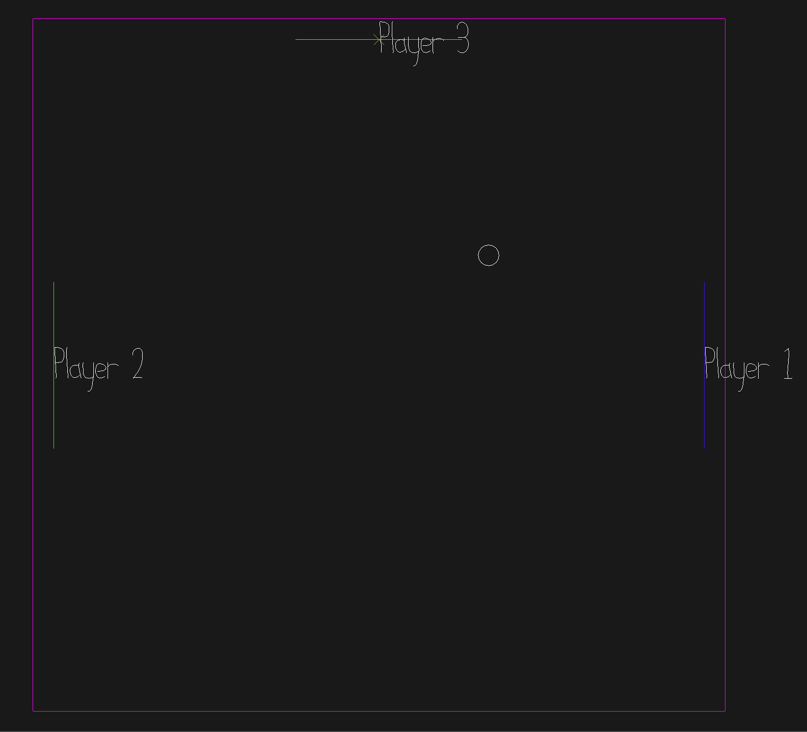

# Po(n)ggers

Author: Denise Yang

Design: Multiplayer pong. Ever want to play pong with more than just two people?? Here's your chance!

Networking: My game builds ontop of the base code by adding the ball position, ball velocity, and player id to the send buffers in send_state_message and will read those values in recv_state_message.

Screen Shot:

How To Play:

Use AD to move either left and right or up and down respectively. Don't let the ball hit the wall or else you're done! 

Sources: 

This game was built with [NEST](NEST.md).

